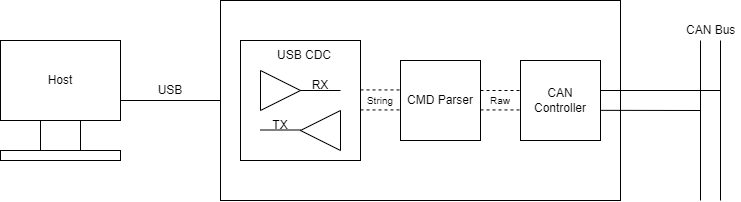
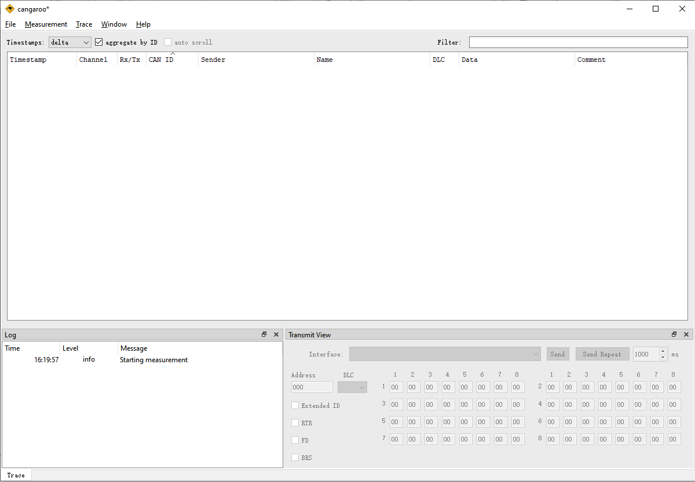
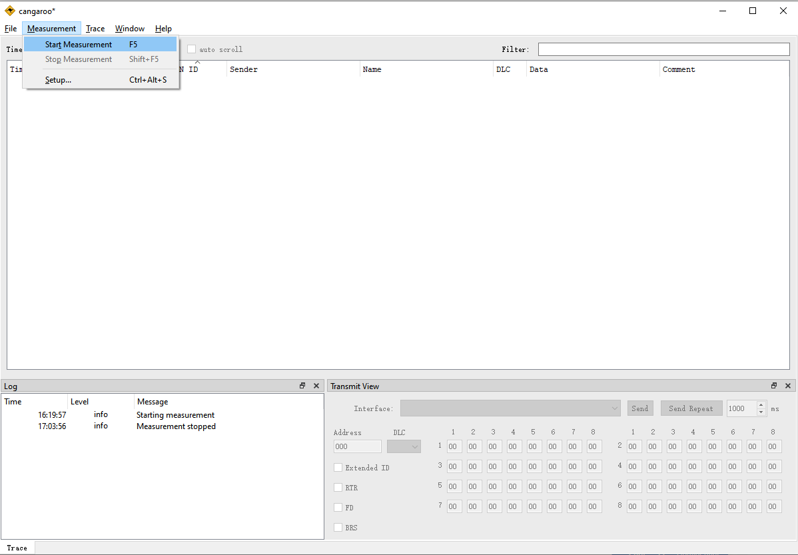
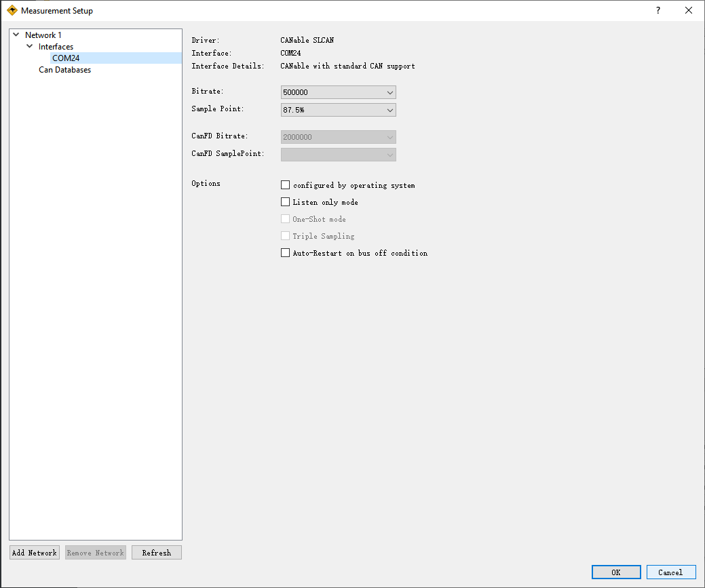
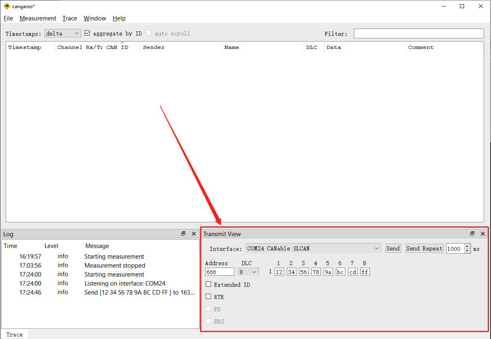
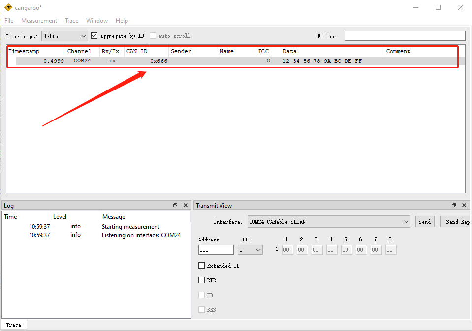

# CANable Tool

[TOC]



<p align="center">图 1 CANable 通讯示意图</p>

## 简介

本方案是基于 MM32F5330 参考 CANable 开源方案实现的 USB-CAN 调试工具 。MM32F5330 MCU 基于 Star-MC1 内核，主频最高可达 180 MHz，具有 USB 和 FlexCAN 等 IP外设，可满足该方案硬件性能要求。从功能实现角度分析其固件代码可分为 CAN 、USB 和 LED 三个部分进行实现。

### CANable

- CANable 是一个小型的低成本开源 USB-CAN 适配器。CAN 作为计算机上的虚拟串行端口枚举，并充当到 CAN 总线接口的串行线。

- CANable 适配器兼容基于arm的 嵌入式平台，如树莓派、树莓派Zero、ODROID、BeagleBone等，非常适合集成到OEM产品中。

### CANable 特性

-  支持 CAN 2.0 A 和 CAN 2.0 B，波特率高达 1 M。
- CANable 使用了 SLCAN 协议进行数据解析，且 SLCAN  在 Linux 内核代码里面已有支持。
- 配套软件
    - Cangaroo (Windows, Linux):上位机软件，用于发送/接收标准和 FD 帧，解码DBC文件的消息。
    - SocketCAN (Linux) 使用 SLCAN 支持本地 Linux。
    - Python - CAN (Windows, Linux, Mac)使用 CANable 和 Python 脚本轻松地与 CAN 总线接口。


## CAN 部分

CAN 部分负责接收来自 CAN 总线上的数据，和负责执行来自上位机的发送 CAN 帧指令。

### CAN  接收

在从上位机接收到 CAN 的运行参数后，CAN 模块开始启动运行，通过 RX FIFO 方式接收来自 CAN 总线的数据。在 CAN 总线上线后且 RX FIFO 中有数据时，slcan 解析器将从 RX FIFO 中提取数据，并通过 slcan_parse_frame() 函数将接收到 CAN 帧数据按 slcan 协议格式解析成字符串，并通过 USB-CDC 协议传输给上位机软件。

代码如下：

```c
while (1)
{
    cdc_process();
    led_process();
    can_process();

    // If CAN message receive is pending, process the message
    if (is_can_msg_pending() != 0u)
    {
        // If message received from bus, parse the frame
        if (can_rx(&rx_msg_header, rx_msg_data) == true)
        {
            // Parse an incoming CAN frame into an outgoing slcan message
            uint16_t msg_len = slcan_parse_frame((uint8_t *)&msg_buf, &rx_msg_header, rx_msg_data);

            // Transmit message via USB-CDC
            if(msg_len)
            {
                tud_cdc_write(msg_buf, msg_len);
                tud_cdc_write_flush();
            }
        }
    }
}
```

### CAN 发送

从 main.c 文件的 while 循环中的 cdc_process() 函数中将从 USB 接收到的数据按照 slcan 协议解析，设置 CAN 运行参数或添加 CAN 发送数据到发送队列中。通过源码中的 islcan_parse_str() 函数实现，并在该 islcan_parse_str() 函数中调用 can_tx 函数将待发送的数据填充中 CAN 发送队列中。

在 main.c 文件的 while 循环中，通过 can_process 函数将 CAN 发送队列中的数据通过 CAN 模块发送出去。代码如下：

```c
void can_process(void)
{
    if((txqueue.tail != txqueue.head) && ((FLEXCAN_GetStatus(BOARD_FLEXCAN_PORT) & FLEXCAN_STATUS_TX) == 0u) )
    {
        // Transmit can frame
        uint32_t status = FLEXCAN_WriteTxMb(BOARD_FLEXCAN_PORT, BOARD_FLEXCAN_TX_MB_CH, &txqueue.header[txqueue.tail]);
        FLEXCAN_SetMbCode(BOARD_FLEXCAN_PORT, BOARD_FLEXCAN_TX_MB_CH, FLEXCAN_MbCode_TxDataOrRemote); /* Write code to send. */
        txqueue.tail = (txqueue.tail + 1) % TXQUEUE_LEN;

        led_green_on();

        // This drops the packet if it fails (no retry). Failure is unlikely
        // since we check if there is a TX mailbox free.
        if(status != true)
        {
            error_assert(ERR_CAN_TXFAIL);
        }
    }
}
```


## USB 部分

USB 部分负责接收上位机的指令，和发送 CAN 总线的活动状态。采用 Communications Devices Class (CDC) 协议通信。

USB 协议栈采用 TinyUSB 实现 CDC，通过 tud_cdc_available() 判断是否上位机有向设备发送指令，tud_cdc_read() 读取指令，tud_cdc_write() 和 tud_cdc_write_flush() 发送活动状态。

值得注意的是，上位机发送的指令为字符串形式，设备汇报 CAN 总线活动状态时，也是以字符串的形式汇报。

受限于上位机软件，设备描述符的 Vendor ID 和 Product ID 必须为 0xAD50 和 0x60C4，不能随制造商的变化而变化。

### 描述符

设备描述符：

~~~c
tusb_desc_device_t const desc_device =
{
    .bLength            = 0x12,	  /* device desc len. */
  	.bDescriptorType    = 0x01,   /* device desc type. */
  	.bcdUSB             = 0x0110, /* usb1.1. */
  	.bDeviceClass       = 0x02,   /* Communications Devices Class, CDC. */
  	.bDeviceSubClass    = 0x02,   /* abstract control model. */
  	.bDeviceProtocol    = 0x00,   /* not use protol. */
  	.bMaxPacketSize0    = 0x40,   /* 64 byte is the max packet size of end point 0. */
 	.idVendor           = 0xAD50, /* vendor ID，this vendor ID is invalid but unmodifiable. */
  	.idProduct          = 0x60C4, /* vroduct ID，this product ID is unmodifiable. */
  	.bcdDevice          = 0x0200, /* device version. */
  	.iManufacturer      = 0x01,   /* manufacturer string index. */
  	.iProduct           = 0x02,   /* product string index. */
  	.iSerialNumber      = 0x03,   /* serial number string index. */
  	.bNumConfigurations = 0x01    /* configuration numbers. */
};
~~~

配置描述符：

~~~c
enum
{
  ITF_NUM_CDC = 0,
  ITF_NUM_CDC_DATA,
  ITF_NUM_TOTAL
};

#define EPNUM_CDC_NOTIF   0x81
#define EPNUM_CDC_OUT     0x02
#define EPNUM_CDC_IN      0x83

#define CONFIG_TOTAL_LEN    (TUD_CONFIG_DESC_LEN + TUD_CDC_DESC_LEN)

// full speed configuration
uint8_t const desc_fs_configuration[] =
{
  // Config number, interface count, string index, total length, attribute, power in mA
  TUD_CONFIG_DESCRIPTOR(1, ITF_NUM_TOTAL, 4, CONFIG_TOTAL_LEN, 0x00, 100),

  // Interface number, string index, EP notification address and size, EP data address (out, in) and size.
  TUD_CDC_DESCRIPTOR(ITF_NUM_CDC, 5, EPNUM_CDC_NOTIF, 8, EPNUM_CDC_OUT, EPNUM_CDC_IN, 64),
};


~~~

字符串描述符：

~~~c
char const* string_desc_arr [] =
{
  (const char[]) { 0x09, 0x04 }, // 0: is supported language is English (0x0409)
  "MindMotion",                  // 1: Manufacturer
  "CANable",                     // 2: Product
  "123456",                      // 3: Serials, should use chip ID
  "CDC Config"                   // 4: CDC Config
  "CDC Interface",               // 5: CDC Interface
};
~~~

### 接收指令

当上位机发送指令后，设备会将收到的指令存入到缓存中，调用 slcan_parse_str() 函数解析和执行指令。

由于上位机可能不会将一帧指令整包发送，所以设备需要将接收到的来自上位机的信息存入到缓存中，直到收到 ’\r‘ 字符时，才开始解析指令。

代码如下：

~~~c
uint8_t slcan_str[SLCAN_MTU];
uint32_t slcan_str_index = 0;
// Process incoming USB-CDC messages from RX FIFO
void cdc_process(void)
{
    __disable_irq();

    if ( tud_cdc_available() )
    {
        // read datas
        char buf[64];
        uint32_t buf_cnt = tud_cdc_read(buf, sizeof(buf));

        for (uint32_t i = 0; i < buf_cnt; i++)
        {
            /* a complete cmd frame. */
            if (buf[i] == '\r')
            {
                /* parse cmd. */
                slcan_parse_str(slcan_str, slcan_str_index);
                slcan_str_index = 0;
            }
            else
            {
                if (slcan_str_index >= sizeof(slcan_str))
                {
                    slcan_str_index = 0;
                }
                slcan_str[slcan_str_index] = buf[i];
                slcan_str_index++;
            }
        }
    }

    __enable_irq();
}
~~~

### 发送信息

当设备接收到 CAN 总线上的活动信息后，会将 CAN 总线上的活动信息转换为字符串信息，调用 CDC 发送指令，将字符串信息发送给上位机。

代码如下：

~~~c
while (1)
{
    cdc_process();
    led_process();
    can_process();

    // If CAN message receive is pending, process the message
    if (is_can_msg_pending() != 0u)
    {
        // If message received from bus, parse the frame
        if (can_rx(&rx_msg_header, rx_msg_data) == true)
        {
            // Parse an incoming CAN frame into an outgoing slcan message
            uint16_t msg_len = slcan_parse_frame((uint8_t *)&msg_buf, &rx_msg_header, rx_msg_data);

            // Transmit message via USB-CDC
            if(msg_len)
            {
                tud_cdc_write(msg_buf, msg_len);
                tud_cdc_write_flush();
            }
        }
    }
}
~~~


## LED 部分

程序中提供了 CAN 数据收发状态指示灯功能，当接收到一帧 CAN 数，则蓝灯亮 500ms， 当发送一帧 CAN 数据时，则绿灯亮 500ms，且当连续收发数据时保持亮的时间不可叠加，即亮 500ms 必然会灭 500ms。LED 指示灯的状态在 led_process 函数中维护，使用了 Systick 作为时钟进行计时。

代码如下所示：

```c
// Process time-based LED events
void led_process(void)
{
    // If LED has been on for long enough, turn it off
    if(led_blue_laston > 0 && uwTick - led_blue_laston > LED_DURATION)
    {
        GPIO_WriteBit(LED_BLUE, 1);
        led_blue_laston = 0;
        led_blue_lastoff = uwTick;
    }

    // If LED has been on for long enough, turn it off
    if(led_green_laston > 0 && uwTick- led_green_laston > LED_DURATION)
    {
        GPIO_WriteBit(LED_GREEN, 1);
        led_green_laston = 0;
        led_green_lastoff = uwTick;
    }
}
```


## cangaroo 的使用

注:这里以 2023 年发布的 cangaroo-win32-ccdcb64 版本为例，在 win10 操作系统环境下进行介绍。

### 编译并 烧录  CANable 

将 CANable 的源码编译烧录进 MM32F5330 MCU 后，在 CAN 接线处接入 CAN 总线网络，在 USB 接口处接入 USB 数据线并连接到电脑端。

### 下载上位机软件

网址：https://canable.io/utilities/cangaroo-win32-ccdcb64.zip

下载完成后解压cangaroo-win32-ccdcb64.zip文件

### 运行  cangaroo.exe

进入解压后的文件夹，鼠标左键双击 cangaroo.exe 文件，打开后主界面如图 2 所示：



<p align="center">图 2</p>

### 添加设备


如下图 2 所示，点击 **Measurem -> Star Measurement** 选项，进入添加设备页面



<p align="center">图 3</p>


点击 **Refresh** 按钮后，便可扫描出对应端口号的设备，点击对应的 **COM** 号，选择需要的比特率并点击 **OK** 按钮。



<p align="center">图 4</p>


### 发送 CAN 帧

点击 **OK** 按钮后回到主界面，可看到如图 5 右下方的 Transmit View 窗口，如下图 5 所示，修改 CAN ID 为 0x`666,` 数据长度(DLC)为 `8`， 数据为：`12 34 56 78 9A BC DE FF` 后，点击 **Send** 即可发送。若点击 **Send Repeat** 则将以 1000ms 的周期循环发送当前数据帧。



<p align="center">图 5</p>


### 接收 CAN 帧

在添加设备完成后即可进入 CAN 总线监听状态，当监听到有效 CAN 帧后，便会在按下图 6 所示进行显示。



<p align="center">图 6</p>


## 结语

本文讲解了基于 MM32F5330 MCU，实现开源 CANable 的 USB-CAN 适配器方案，并介绍了配套的上位机软件 cangaroo 的使用。


## 参考文献

canable-fw(固件源码)

- https://github.com/normaldotcom/canable-fw
- slcan 基于 MIT 协议开源 

cangaroo(上位机)

- 源码：https://github.com/normaldotcom/cangaroo/
- cangaroo 基于 GPL-2.0 协议开源
- 使用的编译版本：https://canable.io/utilities/cangaroo-win32-ccdcb64.zip